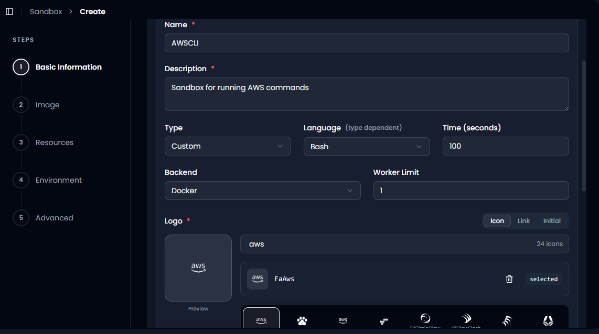
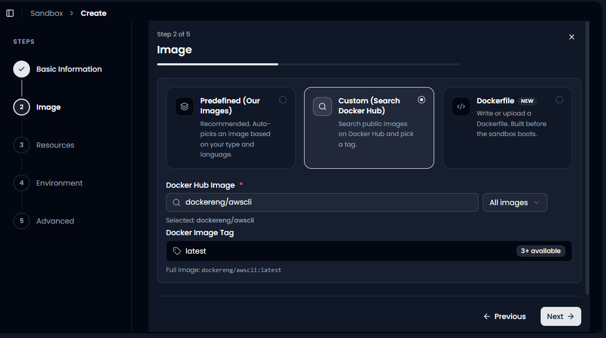
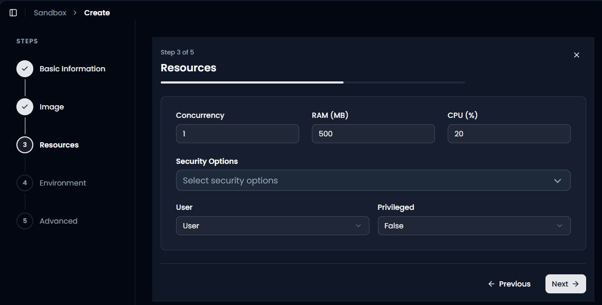
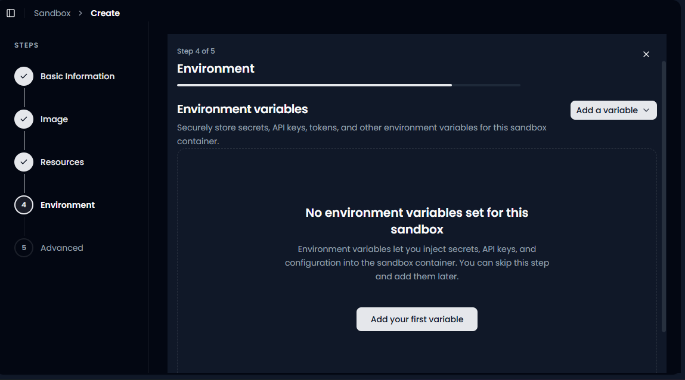
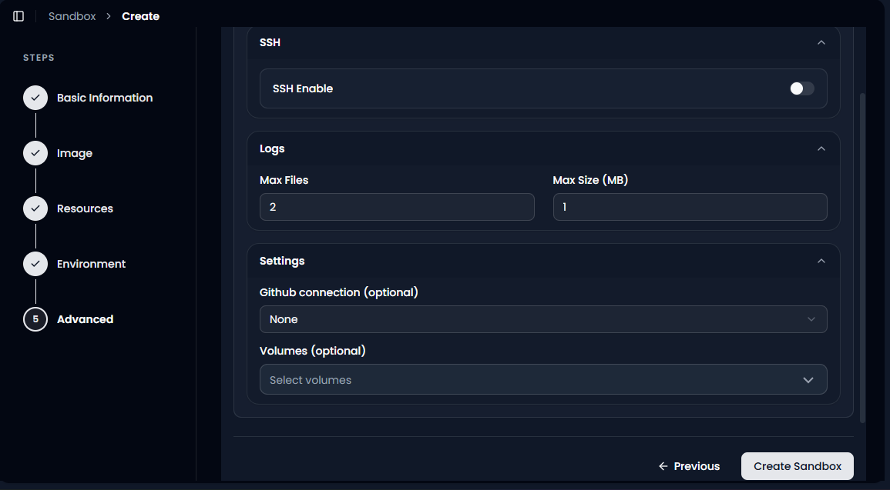

Create an AWS CLI Sandbox
=========================

A sandbox is an isolated container where your code runs on its own,
separate from everything else in your system. Nothing it does can affect
your other workflows, your other sandboxes, or GRiPO itself. This
guide walks through creating an AWS CLI sandbox from scratch, explaining
what every field and option actually does, so you understand not just
*what* to click but *why* you're clicking it.

This tutorial follows the same wizard as the
:doc:`Python <create-python-sandbox>` and
:doc:`JavaScript <create-javascript-sandbox>` sandbox guides, the
steps are identical, but this one introduces a genuinely different Type
and Image path, worth paying attention to since it's not just a language
swap this time.

--------------

Step 1 of 5: Basic Information
------------------------------

Name (required)
~~~~~~~~~~~~~~~

A unique label for the sandbox, for example ``AWSCLI``. This is how you
and your teammates will find it again in the sandbox list.

Description (required)
~~~~~~~~~~~~~~~~~~~~~~

A short sentence explaining the sandbox's purpose, for example *"Sandbox
for running AWS commands."*

Type
~~~~

Set to **Custom** here, not Code. This is the first real difference from
the Python and JavaScript guides.

**Why Custom instead of Code:** the Code type is meant for running
application logic written in a specific programming language, Python,
JavaScript, and so on. AWS CLI isn't a programming language, it's a
command line tool you invoke through a shell. So instead of picking a
language runtime, you're building a sandbox around a specific
purpose-built tool, which is exactly what the Custom type is for.

**What happens if you chose Code instead:** you'd be asked to pick a
language like Python or JavaScript, neither of which is what you
actually want here, there'd be no clean way to express "just give me a
shell with the AWS CLI installed."

Language *(type dependent)*
~~~~~~~~~~~~~~~~~~~~~~~~~~~

Set to **Bash**. Even though this isn't a "Code" sandbox, GRiPO
still needs to know what shell environment to give you, since that's how
you'll actually type and run AWS CLI commands (``aws s3 ls``,
``aws ec2 describe-instances``, and so on).

Time (seconds)
~~~~~~~~~~~~~~

The maximum execution time allowed for a single run, set to ``100``
seconds here.

**What happens if you set it too low:** an AWS command that takes a
while, like listing a large number of resources across regions, could
get cut off before it finishes.

**What happens if you set it too high:** a command that hangs (for
example waiting on a slow or misconfigured API call) keeps consuming
resources for the full duration instead of failing fast.

Backend
~~~~~~~

The underlying execution engine that runs your container, set to
**Docker**.

Worker Limit
~~~~~~~~~~~~

How many workers this sandbox can use at once, set to ``1`` here. Low
means simultaneous runs queue up; higher means more parallel throughput
but shared resource use, same trade-off as the other sandboxes.

Logo (required)
~~~~~~~~~~~~~~~

Search for something relevant, here ``aws`` surfaces the AWS logo pack
directly, and ``FaAws`` gets selected. Straightforward and unambiguous
in this case, unlike the JavaScript logo search, there's no naming
overlap to trip over here.

Once everything on this page is filled in, click **Next**.

--------------

Step 2 of 5: Image
------------------

This is the second real difference from the earlier guides. Instead of
using Predefined or searching loosely, this example goes straight to a
**specific, known image**.

Custom (Search Docker Hub)
~~~~~~~~~~~~~~~~~~~~~~~~~~

The **Docker Hub Image** field has ``dockereng/awscli`` typed in
directly, this is a known, purpose-built image that comes with the AWS
CLI already installed, maintained by the ``dockereng`` organisation on
Docker Hub. Once selected, GRiPO confirms it under the field as
**"Selected: dockereng/awscli."**

**Why go straight to a specific image instead of Predefined:**
Predefined works well for general-purpose languages like Python or
JavaScript, where GRiPO can guess a sensible default. AWS CLI is a
specific tool, not a language, so there usually isn't a generic
"predefined" match for it, you need an image that was actually built to
include the AWS CLI binary and its dependencies.

Docker Image Tag
~~~~~~~~~~~~~~~~

A new field that didn't show up in the earlier guides, once you've
picked an image, you also pick a **tag**, which is a specific version of
that image. Here it's set to ``latest``, with the interface showing
**"3+ available"**, meaning there are multiple tagged versions to choose
from if you needed a specific one.

**What happens if you use ``latest``:** you always get whatever the
image maintainer currently considers the most recent stable build.
Convenient, but it can change over time without warning, if the
maintainer pushes a new ``latest`` build, your sandbox could start
behaving differently the next time it pulls the image.

**What happens if you pin a specific version tag instead** (for example
something like ``2.15.30`` if it were available): your sandbox stays
consistent and predictable indefinitely, since that exact version never
changes. This matters more once you're relying on a sandbox for real,
repeated workflows, since an unexpected AWS CLI version bump could
change command behaviour or output format under you.

Underneath, GRiPO shows the fully resolved reference:
**``dockereng/awscli:latest``**, this is the exact image and version
your sandbox will actually pull and run, worth double checking before
moving on.

Once you've confirmed the image and tag, click **Next**.

--------------

Step 3 of 5: Resources
----------------------

Same as the other guides, this step controls how much of the underlying
machine your sandbox can use, and how locked down it is.

Concurrency
~~~~~~~~~~~

Set to ``1``. Low means simultaneous AWS CLI runs queue up and wait
their turn; higher allows parallel runs but they share the same RAM and
CPU pool below.

RAM (MB)
~~~~~~~~

Set to ``500`` MB.

**What happens if it's too low:** AWS CLI commands that return large
amounts of data, for example listing every object in a large S3 bucket,
or describing hundreds of EC2 instances, could run out of memory partway
through.

**What happens if it's higher than needed:** the sandbox runs fine, but
reserves more memory than a typical AWS CLI command actually needs.

CPU (%)
~~~~~~~

Set to ``20`` percent. AWS CLI commands are mostly waiting on network
responses rather than doing heavy computation, so this generally matters
less here than it would for a data-processing Python script, but a very
low value can still slow down commands that process or format large
responses locally.

Security Options, User, and Privileged
~~~~~~~~~~~~~~~~~~~~~~~~~~~~~~~~~~~~~~

Same logic as the other guides: **Security Options** applies OS-level
restrictions on the container, **User** (rather than Root) keeps the
sandbox running with standard, restricted permissions, which is all a
normal AWS CLI command needs, and **Privileged: False** keeps the
container from getting extended low-level capabilities it has no real
reason to need.

**Worth calling out specifically for AWS CLI:** since this sandbox will
likely hold real AWS credentials (see Environment Variables next),
keeping User and Privileged at their safe defaults matters even more
here than in a generic scripting sandbox, you're directly protecting
access to your actual cloud account, not just a local script's own
resources.

Once your resource and security settings are in place, click **Next**.

--------------

Step 4 of 5: Environment Variables
----------------------------------

This step matters more for an AWS CLI sandbox than almost any other
type, since the AWS CLI needs credentials to do anything useful.

**Why this matters here specifically:** the AWS CLI authenticates using
access keys, typically ``AWS_ACCESS_KEY_ID`` and
``AWS_SECRET_ACCESS_KEY`` (and sometimes ``AWS_DEFAULT_REGION``). These
are exactly the kind of values environment variables exist to protect,
if you were to type them directly into a script or command inside the
sandbox instead, they'd be sitting in plain text wherever that script
lives.

On a new sandbox, this list starts empty, as shown by **"No environment
variables set for this sandbox."** For this sandbox to actually run AWS
commands, you'll need to come back to this step (or add them now via
**Add your first variable**) and set at least your access key ID and
secret access key before your first real command will succeed.

**What happens if you skip this and try to run an AWS command anyway:**
the AWS CLI will fail immediately with an authentication error, it has
no way to know which AWS account or permissions to use without these
values.

Click **Next** once you've added your credentials, or skip for now if
you're just exploring the setup first.

--------------

Step 5 of 5: Advanced
---------------------

SSH Enable
~~~~~~~~~~

Off by default here, same trade-off as the other guides: off keeps you
working through GRiPO's own interface and terminal; on gives you
direct SSH access for interactive debugging, only worth enabling if you
specifically need it.

Logs: Max Files and Max Size (MB)
~~~~~~~~~~~~~~~~~~~~~~~~~~~~~~~~~

Set to ``2`` files and ``1`` MB respectively. AWS CLI commands,
especially ones like ``describe-instances`` or ``s3 ls`` on large
buckets, can produce a lot of output, so if you're regularly running
commands with large responses, keep an eye on whether 1 MB per log file
is enough, a truncated log could cut off exactly the output you needed
to check.

GitHub Connection (optional)
~~~~~~~~~~~~~~~~~~~~~~~~~~~~

Set to **None**. For an AWS CLI sandbox this is less commonly needed
than for a Python or JavaScript project, since you're usually running
individual commands or short scripts rather than a full codebase, but
it's there if you want to pull in a repo of saved AWS CLI scripts.

Volumes (optional)
~~~~~~~~~~~~~~~~~~

No volume selected here. Since this sandbox is ephemeral without one,
anything it writes to disk (for example, downloaded files from an
``aws s3 cp`` command) is lost when the sandbox stops or restarts.

**When you'd actually want a volume here:** if part of your workflow
involves downloading files from AWS and needing them to persist between
runs, rather than being fully self-contained round trips (query AWS, get
an answer, done).

Finishing Up
~~~~~~~~~~~~

Once you're happy with everything, click **Create Sandbox**. Your new
AWS CLI sandbox will appear in the **Available Sandboxes** list, ready
to run AWS commands once you've added your credentials.

--------------
Quick Recap
-----------

.. list-table::
   :header-rows: 1
   :widths: 22 38 40

   * - Step
     - What you're deciding
     - Beginner safe default
   * - Step 1: Basic Information
     - Name, description, and the Type, which is **Custom** here rather than Code
     - Leave Backend as Docker and Worker Limit at 1
   * - Step 2: Image
     - Which tool image the sandbox boots into, and which version tag
     - Use **Custom** with ``dockereng/awscli``, and pin a version tag once you rely on it
   * - Step 3: Resources
     - How much CPU and RAM it gets, and how locked down it is
     - Keep **User** (not Root) and **Privileged: False**
   * - Step 4: Environment Variables
     - Your AWS credentials and default region, kept out of your commands and scripts
     - Add your access key ID and secret access key here. Never type them into a script
   * - Step 5: Advanced
     - SSH access, logging, GitHub, storage
     - Leave SSH off and Volumes unset unless you specifically need persistence

**The one thing that's genuinely different here versus the Python and
JavaScript guides:** Type is **Custom**, not Code, and Image selection
means picking a specific tool image and tag rather than a
general-purpose language runtime. Everything else, Resources,
Environment Variables, and Advanced, follows the exact same logic as
before, just with AWS credentials raising the stakes on getting the
security defaults right.
