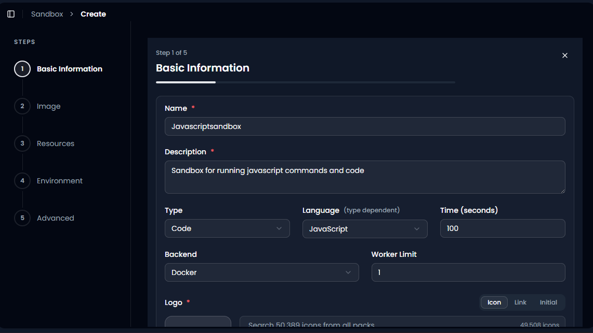
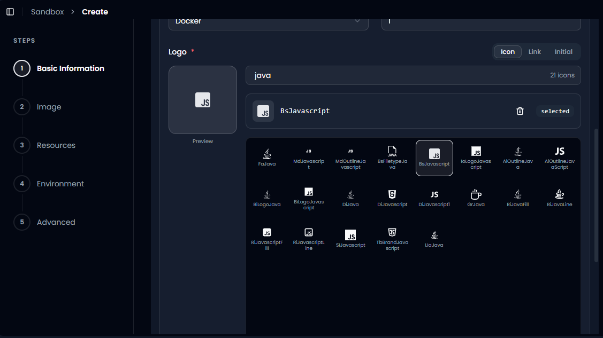
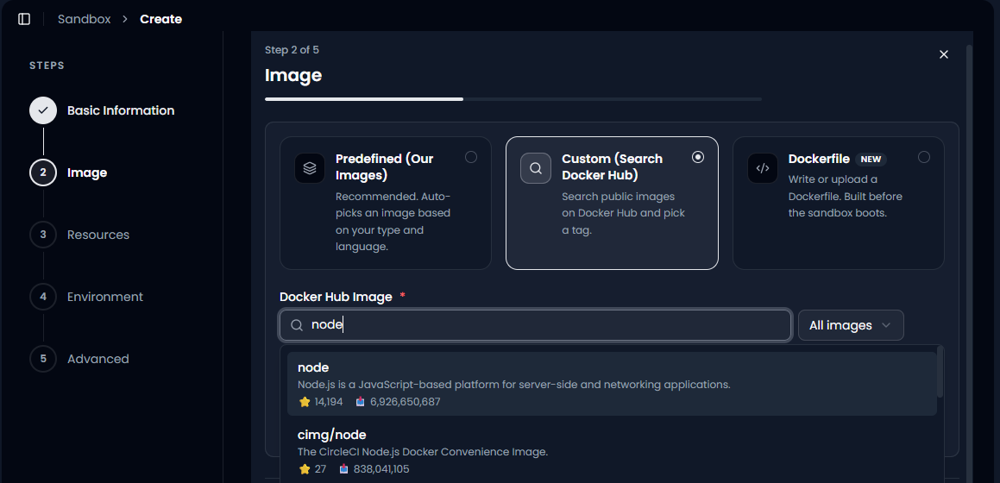
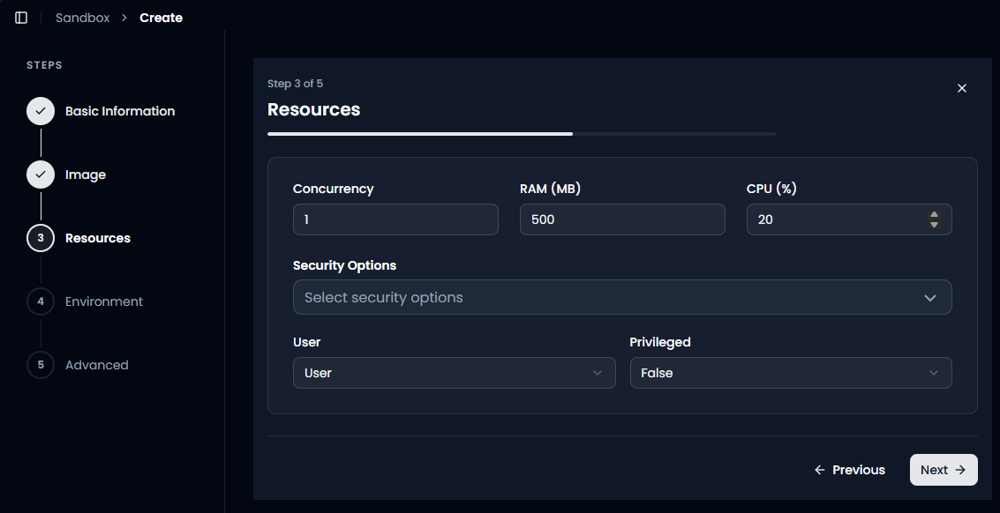
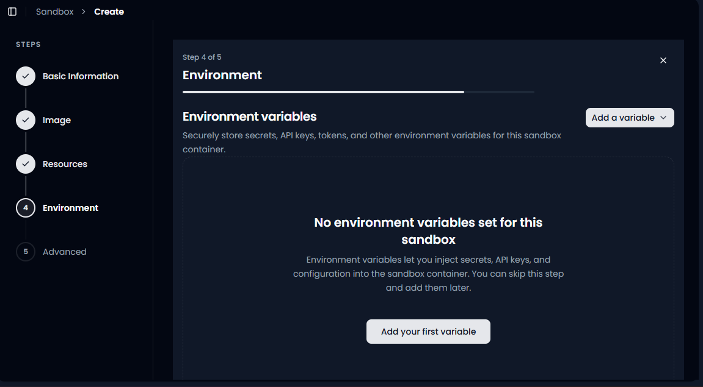
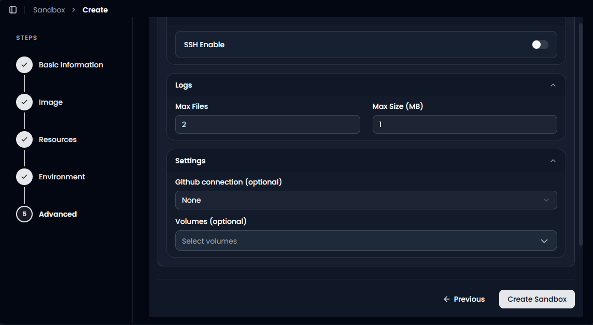

Create a JavaScript Sandbox
===========================

A sandbox is an isolated container where your code runs on its own,
separate from everything else in your system. Nothing it does can affect
your other workflows, your other sandboxes, or GRiPOFlow itself. This
guide walks through creating a JavaScript sandbox from scratch,
explaining what every field and option actually does, so you understand
not just *what* to click but *why* you're clicking it.

This tutorial assumes no prior sandbox experience. If a term is
unfamiliar, it gets explained the first time it shows up. It follows the
same wizard as the `Python sandbox
guide <./create-python-sandbox.md>`__, the steps are identical, only the
language-specific choices change.

--------------

Step 1 of 5: Basic Information
------------------------------

This is where you tell GRiPOFlow what the sandbox is and what it's for.
Every field here shapes how the sandbox behaves later.

Name (required)
~~~~~~~~~~~~~~~

A unique label for the sandbox, for example ``Javascriptsandbox``. This
is how you and your teammates will find it again in the sandbox list.

**What happens if you get this wrong:** nothing breaks technically, but
a vague name becomes a real problem once you have several sandboxes and
can't tell them apart. Name it after what it actually does.

Description (required)
~~~~~~~~~~~~~~~~~~~~~~

A short sentence explaining the sandbox's purpose, for example *"Sandbox
for running javascript commands and code."*

**Why it matters:** anyone else on your team (or future you) should be
able to read this and immediately know whether this is the sandbox they
need, without opening it and guessing.

Type
~~~~

Choose **Code**. This is the type meant for running application logic
and scripts directly, whether that's Python, JavaScript, or Bash, as
opposed to SSH (remote server access), Kubectl (Kubernetes management),
or Cloud Code (cloud service integration).

**What happens if you pick the wrong one:** choosing SSH or Kubectl
instead means you won't get the Language field at all, since the form
changes depending on Type.

Language *(type dependent)*
~~~~~~~~~~~~~~~~~~~~~~~~~~~

Choose **JavaScript**. This tells GRiPOFlow what runtime to expect, and
it feeds directly into the automatic image suggestion in Step 2.

**Worth knowing:** unlike Python, which runs directly on a machine,
JavaScript traditionally runs inside a web browser. To run JavaScript as
a standalone script outside a browser (which is exactly what a sandbox
does), you need a JavaScript runtime, the standard one being
**Node.js**. Keep this in mind, it becomes relevant in the next step.

Time (seconds)
~~~~~~~~~~~~~~

This sets the maximum execution time allowed for a single run, ``100``
seconds in this example.

**What happens if you set it too low:** a script that needs more time,
for example one making several network requests or processing a large
file, gets cut off before it finishes.

**What happens if you set it too high:** if a script hangs or gets stuck
(for example waiting on a request that never resolves), it keeps
consuming resources for the full duration before GRiPOFlow stops it,
instead of failing fast.

Backend
~~~~~~~

The underlying execution engine that runs your container, set to
**Docker**. This is the standard choice for JavaScript sandboxes and
generally doesn't need to change.

Worker Limit
~~~~~~~~~~~~

How many workers (parallel execution processes) this sandbox can use at
once, set to ``1`` here.

**Low limit:** simultaneous runs queue up and wait their turn, fine for
occasional scripts.

**Higher limit:** more runs execute in parallel, useful if this sandbox
gets triggered frequently, but each worker draws from the same RAM and
CPU pool set in Step 3.

Logo (required)
~~~~~~~~~~~~~~~

Purely visual, this is the icon shown next to your sandbox in the list.
In this example, searching ``java`` surfaces JavaScript-related icons
too (since "java" is a substring of "javascript"), and ``BsJavascript``
gets selected.

**Tip:** if you actually want the Java programming language icon rather
than JavaScript, double check what you select here, the search overlap
between "Java" and "JavaScript" makes it easy to grab the wrong one by
accident.

None of this affects how the sandbox runs, it's entirely cosmetic, but a
clear, correct icon makes your sandbox list much easier to scan later.

Once everything on this page is filled in, click **Next**.

--------------

Step 2 of 5: Image
------------------

   image

This step decides exactly what software environment your sandbox boots
into. You get three options:

Predefined (Our Images)
~~~~~~~~~~~~~~~~~~~~~~~

Marked as **Recommended**. GRiPOFlow automatically picks a suitable
image based on the Type and Language you selected in Step 1, in this
case, a ready-to-go Node.js environment.

**Best for:** beginners, or anyone who just wants a working JavaScript
environment without thinking about Docker images at all.

Custom (Search Docker Hub)
~~~~~~~~~~~~~~~~~~~~~~~~~~

Lets you search public images on Docker Hub and pick a specific one,
along with a specific version tag.

In this example, searching ``node`` surfaces the official **node** image
(maintained by Docker's official library, described as *"Node.js is a
JavaScript-based platform for server-side and networking applications,"*
with over 14,000 stars and nearly 7 billion pulls), alongside community
images like ``cimg/node`` (the CircleCI Node.js convenience image, 27
stars, over 838 million pulls).

**What happens if you pick the official image:** you get a well tested,
actively maintained, predictable Node.js environment, and you can choose
exactly which version tag you need (for example ``node:18`` versus
``node:20``) if your code depends on a specific version.

**What happens if you pick a smaller, specialised image instead:**
something like ``cimg/node`` is built for a specific purpose (in this
case, CircleCI pipelines) and may include extra tooling you don't need,
or be missing something you expected. It still might work fine, but the
official image is the safer general-purpose default.

**Best for:** anyone who needs a particular Node.js version, or a base
image with certain tools pre-installed.

Dockerfile *(New)*
~~~~~~~~~~~~~~~~~~

Lets you write or upload your own Dockerfile, a script that defines a
completely custom environment, which GRiPOFlow builds before the sandbox
boots.

**What happens if you use this:** complete control, install any system
packages, any npm packages globally, any configuration you want, built
exactly the way you specify.

**Trade-off:** slower startup since the image has to be built first, and
it requires knowing how to write a Dockerfile. Reach for this only once
Predefined and Custom don't cover what you need.

Once you've selected an image, click **Next**.

--------------

Step 3 of 5: Resources
----------------------

This step sets the limits on how much of the underlying machine your
sandbox is allowed to use, and how locked down it is from a security
standpoint.

Concurrency
~~~~~~~~~~~

How many executions this sandbox can run at the same time, set to ``1``
here.

**Low concurrency:** only one run happens at a time, anything else waits
in line.

**Higher concurrency:** multiple runs happen simultaneously, useful for
a sandbox triggered often, but every simultaneous run draws from the
same RAM and CPU pool below.

RAM (MB)
~~~~~~~~

The amount of memory available to the sandbox, set to ``500`` MB here.

**What happens if it's too low:** scripts that need more memory, for
example ones handling large JSON payloads, big arrays, or lots of
concurrent network requests, will crash with an out-of-memory error
partway through.

**What happens if it's higher than needed:** the script runs fine, but
you're reserving more memory than necessary.

.. _cpu-:

CPU (%)
~~~~~~~

The share of CPU processing power available to the sandbox, set to
``20`` percent here.

**What happens if it's too low:** anything computationally heavy (large
loops, heavy data transformation) runs noticeably slower.

**What happens if it's higher:** faster execution for CPU-intensive
tasks, at the cost of using more of the shared compute resources.

Security Options
~~~~~~~~~~~~~~~~

Applies operating-system level restrictions on what the container is
allowed to do, an extra layer of protection independent of User and
Privileged below.

User
~~~~

Choose between:

-  **User**: a standard, restricted account. Handles typical Node.js
   scripts fine, reading files, calling APIs, installing npm packages.
-  **Root**: full administrative access inside the container.

**What happens if you choose User (the safer default):** your JavaScript
code runs normally for the vast majority of use cases.

**What happens if you choose Root instead:** needed only if your script
has to do something that genuinely requires elevated permissions. Root
access also means more potential for damage if something in your code
goes wrong or gets exploited. Default to **User** unless you have a
specific, known reason to need Root.

Privileged
~~~~~~~~~~

Set to **True** or **False**, defaulting to ``False`` here.

**What happens with False (default and recommended):** the sandbox is
blocked from low-level operations like directly accessing host hardware
or running nested containers. Safe for essentially all standard
JavaScript work.

**What happens with True:** extended capabilities reserved for
specialised cases. This significantly widens what the sandbox could
potentially do if something went wrong, so only enable it when a
specific technical requirement genuinely demands it.

Once your resource and security settings are in place, click **Next**.

--------------

Step 4 of 5: Environment Variables
----------------------------------

Environment variables let you securely inject secrets, API keys, tokens,
and configuration values into the sandbox, without ever writing them
directly into your code.

**Why this matters:** if you hardcode an API key directly inside a
JavaScript file, anyone who sees that code sees the key too. Environment
variables keep sensitive values separate from your code entirely.

On a brand new sandbox, this list starts empty, as shown by **"No
environment variables set for this sandbox."** You can either:

-  Click **Add your first variable** (or **Add a variable** in the top
   right) to define one now, for example a third-party API key your
   script needs to call.
-  Or simply skip this step, you can always come back and add variables
   later.

**What happens if you skip this and your script actually needs a
variable:** the script fails or behaves incorrectly the first time it
tries to read a variable that doesn't exist yet, easy to fix by coming
back to this step.

Click **Next** once you've either added your variables or decided to
skip this step.

--------------

Step 5 of 5: Advanced
---------------------

The final step covers a handful of optional, more specialised settings.

SSH Enable
~~~~~~~~~~

A toggle that turns direct SSH access to the sandbox on or off.

**What happens if it's Off (default):** you can only interact with the
sandbox through GRiPOFlow itself, its built-in terminal, or through
workflows.

**What happens if you turn it On:** you can connect to the running
sandbox directly over SSH, useful for interactive debugging. Only enable
this if you actually need that kind of direct access.

Logs: Max Files
~~~~~~~~~~~~~~~

How many separate log files the sandbox keeps before old ones get
rotated out, set to ``2`` here.

**Low value:** less historical log data kept, less storage used.

**Higher value:** more history preserved, more storage used.

Logs: Max Size (MB)
~~~~~~~~~~~~~~~~~~~

The maximum size of each individual log file, set to ``1`` MB here.

**What happens if it's too small:** a script that logs a lot of output
(common with Node.js request logging or debug output) could have its log
truncated before capturing everything.

**What happens if it's larger:** more complete logs per run, more disk
space used.

GitHub Connection (optional)
~~~~~~~~~~~~~~~~~~~~~~~~~~~~

Lets you link a GitHub repository directly to this sandbox, so it can
pull code straight from a repo.

**Set to None:** the sandbox starts empty, and you'll need to add or
write your code inside it directly.

**Set to a connected repo:** your code comes from version control
automatically, generally the better approach once a project outgrows a
quick one-off script.

Volumes (optional)
~~~~~~~~~~~~~~~~~~

Lets you attach persistent storage to the sandbox.

**Without a volume attached:** the sandbox is ephemeral, any files it
creates while running are lost the moment it stops or restarts.

**With a volume attached:** data persists across restarts, useful if
your script needs to cache downloaded npm packages, build up a dataset,
or maintain state between runs. If you don't already have a volume,
you'll need to create one first through the separate Create Volume flow.

Finishing Up
~~~~~~~~~~~~

Once you're happy with everything, click **Create Sandbox**.

Your new JavaScript sandbox will be built according to everything you've
configured, and it'll appear back in the **Available Sandboxes** list,
ready to run scripts, install npm packages, and be used as a step inside
your workflows.

--------------

Quick Recap
-----------

Quick Recap
-----------

.. list-table::
   :header-rows: 1
   :widths: 22 38 40

   * - Step
     - What you're deciding
     - Beginner safe default
   * - Step 1: Basic Information
     - Name, description, and that this is a **Code** sandbox running **JavaScript**
     - Leave Backend as Docker and Worker Limit at 1
   * - Step 2: Image
     - Which environment the sandbox boots into
     - Use **Predefined**, or **Custom** with the official ``node`` image
   * - Step 3: Resources
     - How much CPU and RAM it gets, and how locked down it is
     - Keep **User** (not Root) and **Privileged: False**
   * - Step 4: Environment Variables
     - Secrets and config your script needs
     - Fine to skip and add later
   * - Step 5: Advanced
     - SSH access, logging, GitHub, storage
     - Leave SSH off and Volumes unset unless you specifically need persistence

If you're just getting started, the safest path through this whole
wizard is: **Code → JavaScript → Predefined image (or Custom with the
official node image) → User (not Root) → Privileged: False → skip
environment variables for now → leave Advanced settings at their
defaults.** You can always come back and adjust any of these later.
.\make.bat html