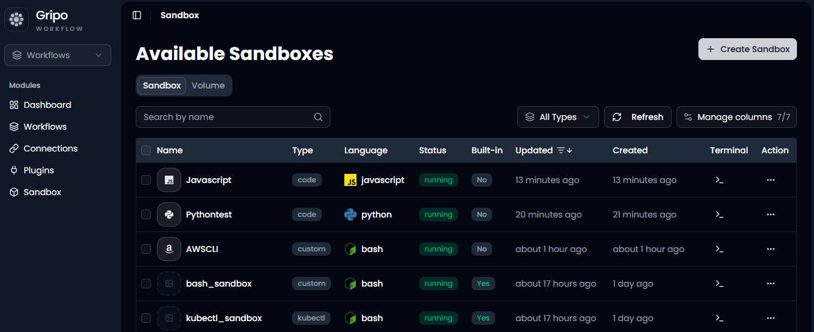
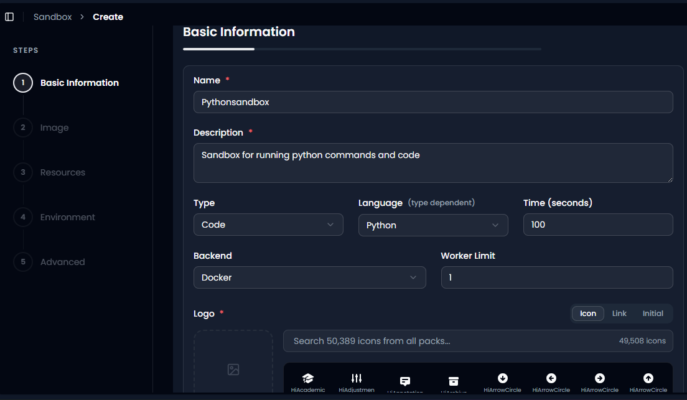
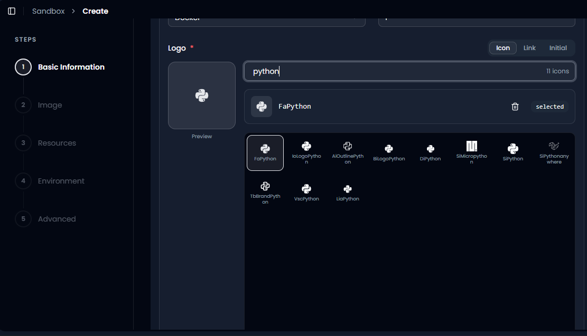
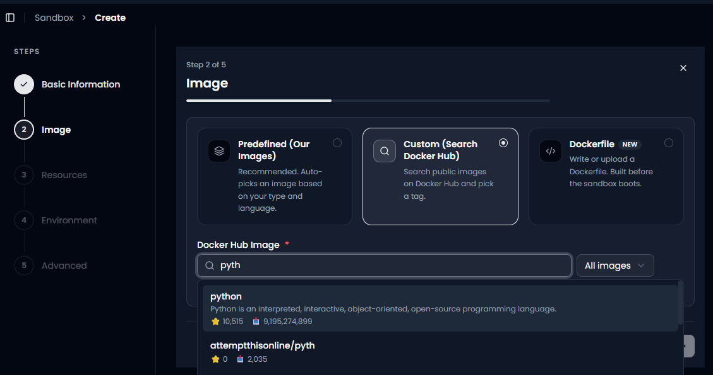
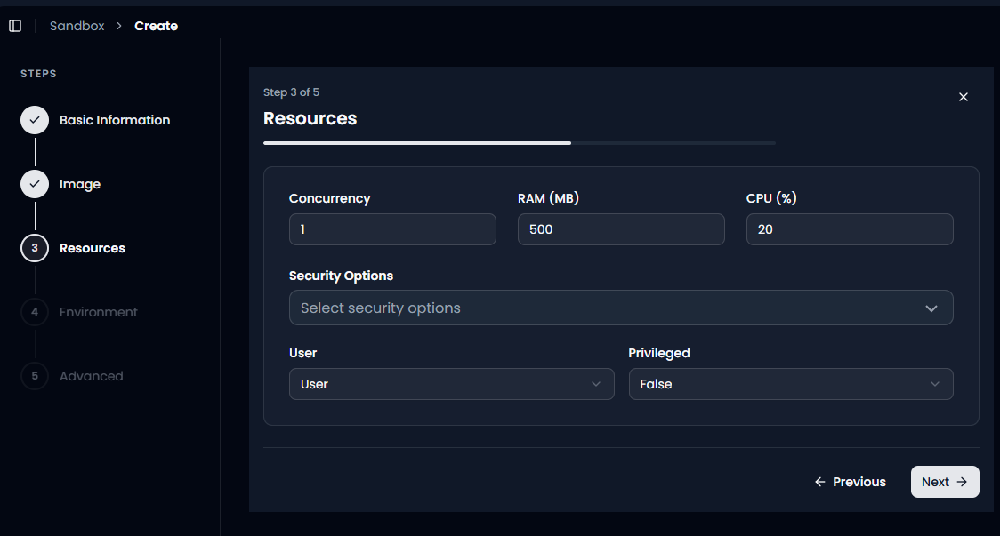
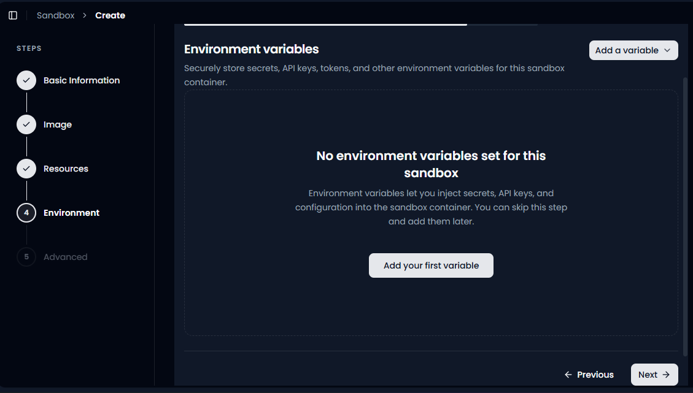
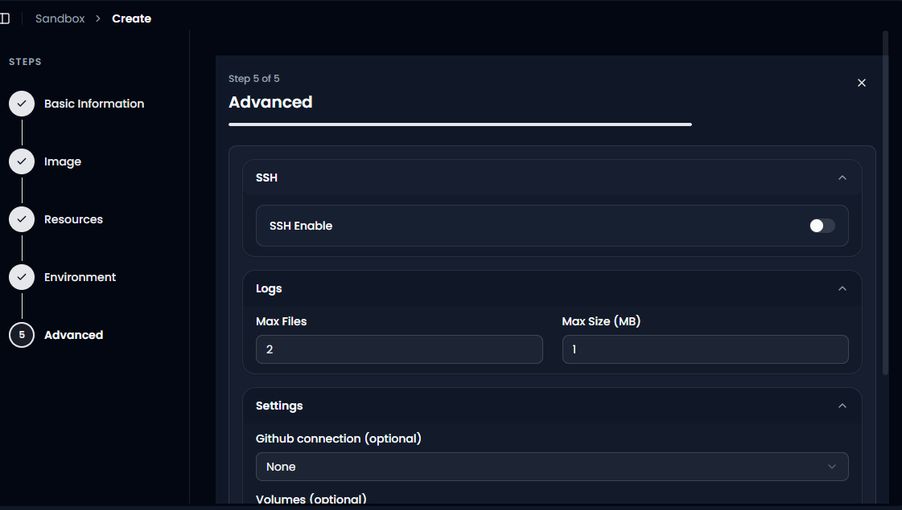
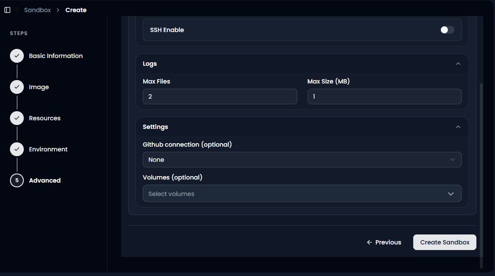

Create a Python Sandbox
=======================

A sandbox is an isolated container where your code runs on its own,
separate from everything else in your system. Nothing it does can affect
your other workflows, your other sandboxes, or GRiPOFlow itself. This
guide walks through creating a Python sandbox from scratch, explaining
what every field and option actually does, so you understand not just
*what* to click but *why* you're clicking it.

This tutorial assumes no prior sandbox experience. If a term is
unfamiliar, it gets explained the first time it shows up.

--------------

Step 0: Open the Sandbox List
-----------------------------

Navigate to **Sandbox** in the left hand menu.

This page shows every sandbox that already exists in your workspace,
along with a quick status view for each:

-  **Name**: what the sandbox is called.
-  **Type**: what kind of sandbox it is (Code, Custom, SSH, Kubectl, and
   so on).
-  **Language**: the programming language or runtime it runs.
-  **Status**: whether it's currently ``running`` or stopped.
-  **Built-in**: whether GRiPOFlow created it automatically (``Yes``),
   or a person created it manually (``No``). Built-in sandboxes are
   provided by the platform for common tasks; the ones you build
   yourself will show ``No`` here.
-  **Updated / Created**: timestamps, useful for knowing which sandboxes
   are actively maintained versus abandoned.
-  **Terminal**: a shortcut to open a live terminal inside that sandbox.
-  **Action**: a menu for editing, duplicating, or deleting the sandbox.

To start building a new one, click **Create Sandbox** in the top right
corner.

--------------

Step 1 of 5: Basic Information
------------------------------

This is where you tell GRiPOFlow what the sandbox is and what it's for.
Every field here shapes how the sandbox behaves later, so it's worth
understanding each one properly rather than rushing through it.

Name (required)
~~~~~~~~~~~~~~~

A unique label for the sandbox, for example ``Pythonsandbox``. This is
how you and your teammates will find it again in the sandbox list.

**What happens if you get this wrong:** nothing breaks technically, but
a vague name like ``test1`` becomes a real problem once you have a dozen
sandboxes and can't tell them apart. Name it after what it actually
does.

Description (required)
~~~~~~~~~~~~~~~~~~~~~~

A short sentence explaining the sandbox's purpose, for example *"Sandbox
for running python commands and code."*

**Why it matters:** anyone else on your team (or future you, six months
from now) should be able to read this and immediately know whether this
is the sandbox they need, without opening it and guessing.

Type
~~~~

This dropdown decides the fundamental behaviour of the sandbox. The
available options are:

-  **Code**: for running application logic and scripts directly, such as
   Python, JavaScript, or Bash. This is the right choice for a Python
   sandbox.
-  **Custom**: for more tailored or specialised setups that don't fit
   neatly into the other categories, often built around a custom Docker
   image.
-  **SSH**: gives you secure remote terminal access to a server, for
   command line administration rather than running your own code.
-  **Kubectl**: built specifically for interacting with and managing
   Kubernetes clusters.
-  **Cloud Code**: built for direct interaction with cloud provider
   services and integrations.

**What happens if you pick the wrong one:** choosing SSH or Kubectl when
you actually wanted to run a Python script means you won't get the
Python-specific options (like the Language field below) at all, because
the form changes depending on Type. For a Python sandbox, always choose
**Code**.

Language *(type dependent)*
~~~~~~~~~~~~~~~~~~~~~~~~~~~

Only appears once you've selected a Type that supports it, like Code.
Choose **Python** here. This tells GRiPOFlow what runtime to expect and,
importantly, feeds into the automatic image suggestion in Step 2.

Time (seconds)
~~~~~~~~~~~~~~

This sets the maximum execution time allowed for a single run inside the
sandbox, in this example, ``100`` seconds.

**What happens if you set it too low:** a script that needs more time to
finish, for example one processing a large file, will get cut off
partway through before it completes.

**What happens if you set it too high:** if a script gets stuck in an
infinite loop or hangs waiting on something, it will keep consuming
resources for the full duration before GRiPOFlow stops it, instead of
failing fast.

A good rule of thumb: set this a bit above how long your script normally
takes to run, not an arbitrarily large number "just in case."

Backend
~~~~~~~

This is the underlying execution engine that actually runs your
container, set to **Docker** here. For most day to day Python work,
Docker is the standard choice and you generally won't need to change it
unless your organisation has a specific reason to use a different
backend.

Worker Limit
~~~~~~~~~~~~

This controls how many workers (parallel execution processes) this
sandbox can use at once, set to ``1`` in this example.

**What happens with a low Worker Limit:** if multiple runs are triggered
at the same time, they queue up and wait their turn instead of running
simultaneously. This is fine for simple, occasional scripts.

**What happens with a higher Worker Limit:** more runs can execute in
parallel, which is useful if this sandbox will be triggered frequently
or by multiple workflows at once, but it also means the sandbox can
consume more CPU and RAM simultaneously, since each worker uses its own
share of the resources you set in Step 3.

Logo (required)
~~~~~~~~~~~~~~~

Purely visual, this is the icon shown next to your sandbox in the list
so it's easy to recognise at a glance.

Click into the icon search, type something relevant like ``python``, and
pick an icon from the results (for example, ``FaPython``). You can also
use **Link** to point to an image URL, or **Initial** to just use a
letter. None of these choices affect how the sandbox runs, this step is
entirely cosmetic, but a clear icon makes your sandbox list much easier
to scan later.

Once everything on this page is filled in, click **Next**.

--------------

Step 2 of 5: Image
------------------

This step decides exactly what software environment your sandbox boots
into, in other words, what's already installed and ready before your
code even runs. You get three options:

Predefined (Our Images)
~~~~~~~~~~~~~~~~~~~~~~~

Marked as **Recommended**. GRiPOFlow automatically picks a suitable
image for you based on the Type and Language you selected in Step 1.

**Best for:** beginners, or anyone who just wants "a working Python
environment" without thinking about Docker images at all. You get
something sensible by default with zero extra decisions.

Custom (Search Docker Hub)
~~~~~~~~~~~~~~~~~~~~~~~~~~

Lets you search public images on Docker Hub and pick a specific one,
along with a specific version tag.

In this example, searching ``pyth`` surfaces the official **python**
image (maintained by Docker's official library, shown with over 10,000
stars and over 9 billion pulls, a strong signal that it's trustworthy
and well maintained) alongside smaller community images like
``attemptthisonline/pyth`` with far fewer stars and pulls.

**What happens if you pick the official image:** you get a well tested,
actively maintained, predictable Python environment, and you can choose
exactly which version tag you need (for example ``python:3.11`` versus
``python:3.12``) if your code depends on a specific version.

**What happens if you pick a random low-star community image instead:**
it might work fine, but it could also be outdated, poorly maintained,
missing expected tools, or in rare cases something worse. Stick to
official or well known, high star images unless you have a specific
reason not to.

**Best for:** anyone who needs a particular Python version, or wants a
base image that already includes certain tools or libraries
pre-installed.

Dockerfile *(New)*
~~~~~~~~~~~~~~~~~~

Lets you write or upload your own Dockerfile, a script that defines a
completely custom environment. GRiPOFlow builds this into a container
image before the sandbox boots.

**What happens if you use this:** you get complete control, install any
system packages, any Python packages, any configuration you want,
exactly the way you want it built.

**Trade-off:** it takes longer to start up (since the image has to be
built first, not just pulled), and it requires knowing how to write a
Dockerfile. This is the advanced option, reach for it only once
Predefined and Custom don't cover what you need.

Once you've selected an image, click **Next**.

--------------

Step 3 of 5: Resources
----------------------

This step sets the limits on how much of the underlying machine your
sandbox is allowed to use, and how locked down it is from a security
standpoint. These settings directly affect both performance and safety.

Concurrency
~~~~~~~~~~~

How many executions this sandbox can run at the same time, set to ``1``
here.

**Low concurrency (like 1):** only one run happens at a time; anything
else waits in line. Simple, predictable, and uses fewer resources
overall.

**Higher concurrency:** multiple runs can happen simultaneously, useful
if this sandbox gets triggered often, but every simultaneous run draws
from the same RAM and CPU pool below, so too many at once can slow all
of them down or cause failures if resources run out.

RAM (MB)
~~~~~~~~

The amount of memory available to the sandbox, set to ``500`` MB in this
example.

**What happens if it's too low:** scripts that need more memory than
allocated, especially ones handling large datasets (think pandas
dataframes, big JSON files, or image processing) will crash with an
out-of-memory error partway through.

**What happens if it's set higher than needed:** the script still runs
fine, but you're reserving more memory than necessary, which is a minor
inefficiency if you're running many sandboxes at once.

Match this to what your script actually needs. A basic script doing
simple calculations needs far less than one processing large files.

.. _cpu-:

CPU (%)
~~~~~~~

The share of CPU processing power available to the sandbox, set to
``20`` percent here.

**What happens if it's too low:** anything computationally heavy (loops
over large data, complex calculations) runs noticeably slower than it
would on a full core.

**What happens if it's higher:** faster execution for CPU-intensive
tasks, at the cost of using more of the shared compute resources.

Security Options
~~~~~~~~~~~~~~~~

A dropdown for selecting the container's security profile. This applies
operating-system level restrictions on what the container is allowed to
do, an extra layer of protection independent of the User and Privileged
settings below.

**Why it matters:** even if your code has a bug or gets exploited
somehow, a properly restricted security profile limits how much damage
it could do to the underlying system.

User
~~~~

Choose between:

-  **User**: a standard, restricted account. It can run typical scripts
   and install typical packages, but doesn't have full system level
   permissions.
-  **Root**: full administrative access inside the container.

**What happens if you choose User (the safer default):** your Python
script runs fine for the vast majority of use cases, reading files,
calling APIs, processing data, installing pip packages, all of that
works normally.

**What happens if you choose Root instead:** you get full access, needed
only if your script has to do something that genuinely requires elevated
permissions, like installing certain system-level packages or modifying
system configuration. Root access also means that if something in your
code goes wrong or is exploited, it has far more potential to cause
damage inside that container. Default to **User** unless you have a
specific, known reason to need Root.

Privileged
~~~~~~~~~~

Set to **True** or **False**, defaulting to ``False`` here.

**What happens with False (default and recommended):** the sandbox is
blocked from certain low-level operations, like directly accessing host
hardware devices or running nested containers. This is the safe setting
for essentially all standard Python work.

**What happens with True:** the container gets extended capabilities
normally reserved for trusted, specialised use cases (for example,
running Docker inside Docker). This significantly widens what the
sandbox could potentially do if something went wrong, so it should only
be enabled when a specific technical requirement genuinely demands it,
not by default.

Once your resource and security settings are in place, click **Next**.

--------------

Step 4 of 5: Environment Variables
----------------------------------

Environment variables let you securely inject things like secrets, API
keys, tokens, and configuration values into the sandbox, without ever
writing them directly into your code.

**Why this matters:** if you hardcode an API key directly inside a
Python script, anyone who sees that code sees the key too, and if that
code ever ends up somewhere public, the key is exposed. Environment
variables keep sensitive values separate from your code entirely.

On a brand new sandbox, this list starts empty, as shown by **"No
environment variables set for this sandbox."** You have two options
here:

-  Click **Add your first variable** (or **Add a variable** in the top
   right) to define one now, for example a database password or a third
   party API key your script needs to call.
-  Or simply skip this step. GRiPOFlow explicitly allows this, you can
   always come back and add variables later once you know exactly what
   your script needs.

**What happens if you skip this and your script actually needs a
variable:** the script will fail or behave incorrectly the first time it
tries to read a variable that doesn't exist yet, but this is easy to
fix, just come back to this step later and add it.

Click **Next** once you've either added your variables or decided to
skip this step.

--------------

Step 5 of 5: Advanced
---------------------

The final step covers a handful of optional, more specialised settings.

SSH Enable
~~~~~~~~~~

A toggle that turns direct SSH access to the sandbox on or off.

**What happens if it's Off (default):** you can only interact with the
sandbox through GRiPOFlow itself, its built-in terminal, or through
workflows. This is simpler and keeps the sandbox's attack surface
smaller.

**What happens if you turn it On:** you (or your team) can connect to
the running sandbox directly over SSH, useful for interactive debugging
or manual poking around inside a live environment. Only enable this if
you actually need that kind of direct access, since every open access
method is one more thing that needs to be secured.

Logs: Max Files
~~~~~~~~~~~~~~~

How many separate log files the sandbox keeps before old ones get
rotated out, set to ``2`` here.

**Low value:** less historical log data is kept, but it also uses less
storage space.

**Higher value:** more history is preserved, useful if you need to look
back at what happened several runs ago, but it uses more storage over
time.

Logs: Max Size (MB)
~~~~~~~~~~~~~~~~~~~

The maximum size of each individual log file, set to ``1`` MB here.

**What happens if it's too small:** a script that logs a lot of output
could have its log truncated (cut off) before capturing everything,
making it harder to debug.

**What happens if it's larger:** more complete logs per run, at the cost
of more disk space used.

GitHub Connection (optional)
~~~~~~~~~~~~~~~~~~~~~~~~~~~~

Lets you link a GitHub repository directly to this sandbox, so it can
pull code straight from a repo rather than you adding files manually.

**Set to None:** the sandbox starts empty, and you'll need to add or
write your code inside it directly.

**Set to a connected repo:** your code comes from version control
automatically, which is generally the better approach once a project is
more than a quick one-off script, since it keeps the sandbox in sync
with your actual codebase.

Volumes (optional)
~~~~~~~~~~~~~~~~~~

Lets you attach persistent storage to the sandbox.

**Without a volume attached:** the sandbox is ephemeral, meaning any
files it creates or modifies while running are lost the moment it stops
or restarts. Every fresh run starts from a clean slate.

**With a volume attached:** data persists across restarts. This matters
if your Python script needs to build up a dataset over time, cache
downloaded files, or maintain any kind of state between runs. If you
don't already have a volume, you'll need to create one first through the
separate Create Volume flow before you can select it here.

Finishing Up
~~~~~~~~~~~~

Once you're happy with everything, click **Create Sandbox**.

Your new Python sandbox will be built according to everything you've
configured, and it'll appear back in the **Available Sandboxes** list,
ready to run scripts, install packages, and be used as a step inside
your workflows.

--------------

Quick Recap
-----------

.. list-table::
   :header-rows: 1
   :widths: 30 35 35

   * - Setting
     - What to choose
     - Why
   * - Type and Language
     - Code, Python
     - Gives you the Python options
   * - Image
     - Predefined
     - A working environment with no extra decisions
   * - User
     - User, not Root
     - Limits damage if the code goes wrong
   * - Privileged
     - False
     - Blocks low level host access
   * - Environment variables
     - Skip for now
     - You can add them later
   * - Advanced
     - Leave at defaults
     - Change only when you need to

If you're just getting started, the safest path through this whole
wizard is: **Code → Python → Predefined image → User (not Root) →
Privileged: False → skip environment variables for now → leave Advanced
settings at their defaults.** You can always come back and adjust any of
these later.
.\make.bat html
